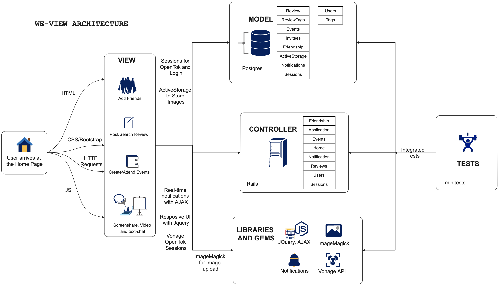
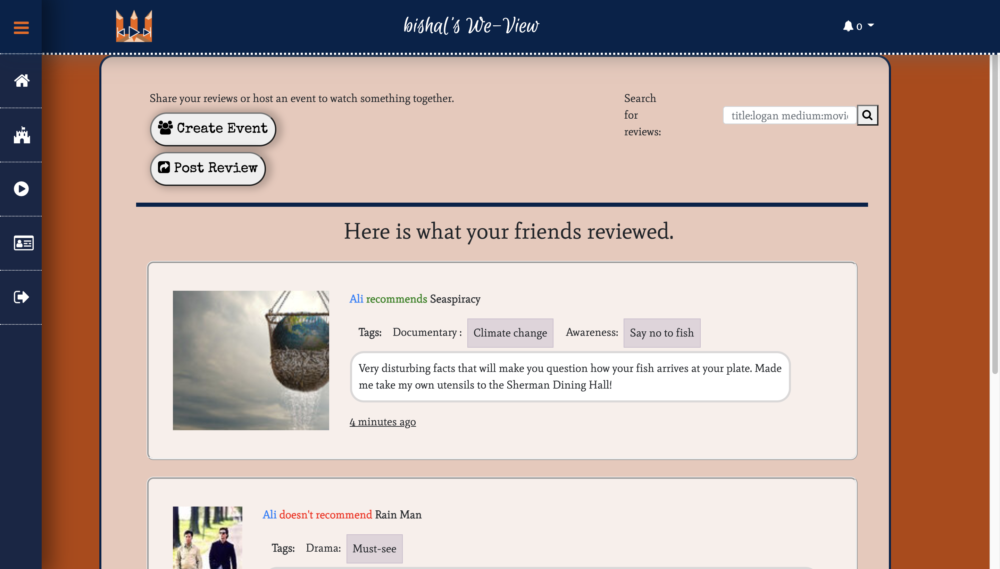

## We-View

<h3>Team Members </h3>
<ul>
   <li>Bishal Baral   (bishalbaral@brandeis.edu)</li>
   <li>Ali Yuksekkaya (adrave@brandeis.edu)</li>
   <li>Andre Evard    (ayuksekkaya@brandeis.edu)</li>
</ul>

<h3> What Is We-View and Who Is It For</h3>

We-View is a platform where friends can come together to share their recommendations on any sort of media and create watch-party events where they can come together and watch the media they want by tuning into the host’s screen-sharing.

We, as the creators of We-View, felt that most of the time people look to their friends for recommendations on what to watch. This is true because rating websites usually contain ratings of millions of users or criticisms of people who watch movies for a living and that might not necessarily resonate with everyone. Furthermore, these sites often prioritize aggregate ratings as a measurement of how ‘good’ a piece of media is, but often the views of many unknown faces mean far less to us than people we personally know.
 

Therefore, we felt a need for a platform that provided users a way to review any media and share that review with their friends, and only their friends. We also added the functionality of screen-sharing to We-View so that people can host watch party events, enabling them to share the media that they recommended with their friends.

    
<h3> How To Use It</h3>

   Users sign up to we-view by using an email address and a username. After signing up the user is assigned a code that makes their profile unique combined with their username. The profile is designed this way to emphasize the fact that We-View is not a large-scale social network website, instead more of a small-scale website where the users can share with their friends and only their friends. Following this format, we decided to go with a user-to-user relation of friendship (e.g. one user sends a request, and the other user must accept it) rather than a follower-poster type relationship.
 

   Tags are made up of pairs of strings, a category for the tag (e.g. ‘genre’), and a name for the tag (e.g. ‘romance’). Users can enter whatever string they want for these tags; they are not predetermined. A basic search feature is also provided for users to search their friends’ reviews by one or more tags, with the option of searching for the review’s title or the medium itself. Ideally, with this freedom, friend groups would be able to come up with their own systems of tagging their recommendations.

   Users can write Reviews-accompanied by images if they so wish-and indicate whether they would recommend this particular media to their friends. These reviews are available to all of their friends, and only their friends. To allow a free-form sort of categorization, users can provide tags when they post a review, with the ability to add more later if necessary.
 

   Users can also schedule Events, sending invitations to some of their friends on event creation. Events are private rooms for the invited guests and the host where they can chat in real-time, and the host can screen share to share media that they would like to watch together. Until the host starts screen-sharing, events can be used as a face-to-face meeting location online. Once the host starts screen-sharing the videos of the users are replaced by the host’s screen and the users can continue communicating through written chat in real-time. Events can only be joined for a set duration that the host sets when they created the event.

   The app also comes equipped with almost real time notifications. Each action (posting a review, creating an event, sending a friend request) generates a notification, for which the intended recipient can see almost immediately.
 

<h3> The Schema </h3>

 Users are the core of our functionality, so most centers around them, but not everything. We have models for Reviews, Events, and Notifications, each of which belongs to a user. There’s also a Friendship model, which links two users together, and an Invitees model, which is used for the non-host users connected to an event. Finally, there is a Tags model, which is in a many-to-many association with Reviews through the ReviewTags model.

<h3>Technologies Used</h3>

Perhaps what makes this what it is, is the technologies we have used. Starting with the most interesting technology: we have used a third-party API, Vonage API, and “opentok” gem, to integrate screen-sharing, real-time video chatting, and real-time written chat functionalities to be used in Events.

We have made use of AJAX and JQuery extensively to make creation of Events, Reviews, and Friendship requests and the delivery of Notifications as seamless as possible.

We have used the “datetime_picker_input” gem to make use of a dynamic calendar while creating Events.

When we wanted to host user-provided images on the site we added Active Storage, MiniMagick, and ImageMagick.

<h3>Engineering Challenges</h3>

Integrating with the Vonage API was pretty difficult and brought a lot of challenges. Screen-sharing is regarded as particularly hard to implement. Nevertheless, we found this API and figured out how to integrate it into our project.

ImageMagick was also difficult to wrangle, as it’s a full application and not a gem (MiniMagick adds its functionality into Ruby). The installation process was different for each of us, and we decided to keep it out of the source code for the time being. This resulted in us having to manually install it on the Heroku container.

To make our app responsive, we added a significant amount of javascript, vanilla, or in the form of jQuery or AJAX. There were a few issues with this, mostly regarding the organization of it within the repo, as Rails 6 appears to have changed its built-in Javascript integration in its assets pipeline and caused many old guides to become defunct. The most prevalent issue was that one old place to import packages had been deprecated, but still worked...on the development side, but it broke the Heroku installation, which was a tricky bug to find and solve.

<h3>Development, Deployment, Testing</h3>

Of course, we used GitHub during the entire process. After a while, we started deploying automatically to Heroku, eventually changing the deployment url to We-View from the initial auto-generated name. Once our schema had been set in stone, we created a number of model tests to ensure they remained stable through the rest of our modifications. In the last few weeks, we added tests on the controllers and some helpers-we don’t have many complicated parts of the code, those are mostly in gems-and added automatic testing whenever we pulled or PR’d to the GitHub repository. This testing proved effective at maintaining functionality, but we found it difficult to implement them as we originally wrote functionality, which culminated in a few troublesome bugs during development as some pieces had vexing edge cases.

At the moment, the GitHub action takes around fifteen minutes as the installations are not cached in the repository, which would be one of our next steps if we were to continue development. We also lack tests on one controller (Events) and a couple of the newer, simple models, which may or may not be added by the time of our final demo.

